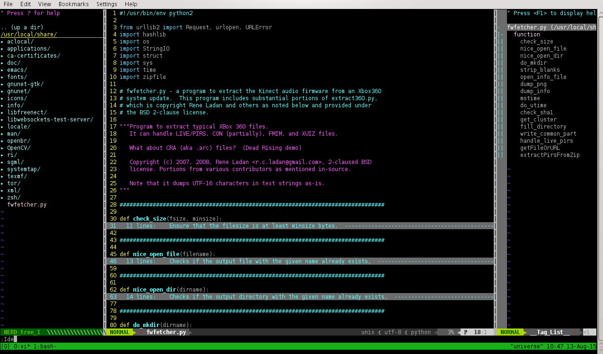

Dot files
===
   Vim dot files 
   Mainly for python highlighting
   The default colorscheme is peaksea.
                        --- Packed by xros
VIM Plugins including
---
*   NERDTree
*   jedi
*   taglist
*   ctags
*   ftplugin
*   supertab
*   vim-multiple-cursors
*   vim-powerline
*   csv.vim
*   and so on , just check it out. For VIM 7.3+

More help
----
* This is very neat for new PC initialization. Mostly for debian/ubuntu or its derived destros.

* Notice that: For some vim users to use taglist/ctags, they would need to install the package "ctags". For example on debian/ubuntu ```sudo apt-get install ctags``` , or on centOS/Fedora/RHEL ```sudo yum install ctags```, or on archlinux ```pacman -S ctags```
* The ```init.sh``` and the ```cp_files.sh``` are very neat for new users both on ubuntu12.04 and ubuntu14.04.
```init.sh``` is compatible with debian7/ubuntu12.04. It's not compatible with ubuntu14.04 due to that ubuntu14.04 has changed some packages. The ```cp_files.sh``` will copy those dotfiles to the system user's home folder.
* There's a Python IDE inside. Type **:Ide** in the Vim prompt console.
For example


For csv/dat file editing


Demo here:


#### Have Fun ####

