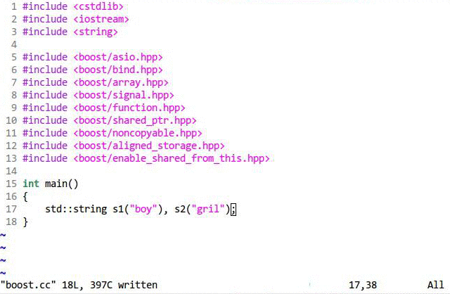
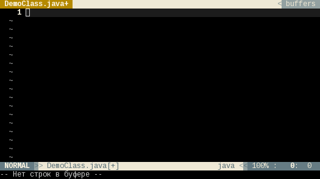
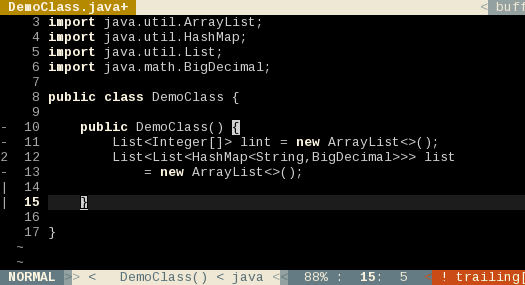

Dot files
===
    Dot files for Bash, Tmux, Zsh, Vim, Elinks, Mutt, Gnupg, Python, Java, Rtorrent.
    A C/C++/Java/Python/HTML IDE for Vim is built in.
    With Machine Learning Settings for TensorFlow 1.4 and Cuda 8.0
                          --- Created by Alexander Liu
VIM Plugins including
---
*   jedi
*   ctags
*   tagbar
*   csv.vim
*   NERDTree
*   ftplugin
*   supertab
*   vim-clang
*   Conque GDB
*   emmet-vim
*   ctrlp.vim
*   colorizer
*   ultisnips
*   indentLine
*   numbers.vim
*   nerdcommenter
*   vim-airline
*   vim-crosshairs
*   vim-fugitive
*   vim-indent-guides
*   vim-airline-themes
*   vim-multiple-cursors
*   vim-javacomplete2
*   vim-python-pep8-indent
*   Default Vim colorscheme is corporation. Also you can try this [**raincode**](https://github.com/xros/dotfiles/blob/master/.vim/colors/raincode.vim)
*   and so on , just check it out. For VIM 7.3+

##### An Easter egg
* Try <kbd>\\</kbd><kbd>r</kbd> to see what's gonna happen in your Vim :) Hit <kbd>Ctrl</kbd><kbd>c</kbd> to escape.

Usage
----
* Use the script ```cp_files.sh``` to **backup** previous files and **replace** them within files in this project. The ```cp_files.sh``` will copy those dotfiles to the system user's home folder.
* These settings are shipped with configuration files for some common tools, including `Elinks, Vim, Mutt, Python(2/3), Zsh, Rtorrent, Golang-go, Ardupilot and etc.`
* Usage:

    
    
* Default Vim colorscheme is molokai
* The bash scheme looks like this by default.

    


Explanation
----
* This is very neat for new PC initialization. Mostly for Debian/Ubuntu or its derived destros. This is friendly compaitble with Ubuntu12.04+/Linuxmint13+/Debian6+/Ubuntu14.04/Ubuntu16.04 and more their derived destros.

* Notice that: For some vim users to use tagbar/ctags, they would need to install the package "ctags". For example on debian/ubuntu ```sudo apt-get install ctags``` , or on centOS/Fedora/RHEL ```sudo yum install ctags```, or on archlinux ```pacman -S ctags```
* The ```init_*.sh``` and the ```cp_files.sh``` are very neat for new users both on ubuntu12.04 and ubuntu14.04.
```init_ubuntu_12.04.sh``` is compatible with Debian7/Ubuntu12.04 while ```init_ubuntu_14.04.sh``` is for Ubuntu14.04. The default Vim provided on Ubuntu 16.04 is not pre-compiled with `Python` support. To use these Vim settings, you should install Vim with Python support. See [here](https://github.com/Valloric/YouCompleteMe/wiki/Building-Vim-from-source) for info about compiling it

Pre-compiled Vim Downloads
-------------------------
I compiled Vim on serveral platforms to make sure you can use my dotfiles without a problem.

Download a Vim deb package pre-compiled with `Java`, `Python`, `Lua`, `Ruby` support.

[ Vim on Debian8/Ubuntu16.04 x86_64](https://drive.google.com/open?id=0BzL1CwVspEkiS2lwUURsQUMtYUU), 

[ Vim 8.0.0133 on Debian7/Ubuntu14.04 x86_64](https://drive.google.com/open?id=0BzL1CwVspEkib1pOZEJpYU15SjA), 

[ Vim on Debian8 for ARM 7L Raspberry Pi and NanoPi/NanoPC Computers](https://drive.google.com/open?id=0BzL1CwVspEkiSGZOZ0J1VkNZQWs) 

#### Python IDE
* There's a Python IDE inside. Type **:Ide** in the Vim prompt console.
* Press <kbd>F9</kbd> to enter Python IDE
* Using ```:b [your_file_name]``` to switch between different buffers windows in Vim
    

    Paste mode toggle: <kbd>F2</kbd>

    numbers.vim toggle: <kbd>F3</kbd>

    Re-fresh CtrlP fuzzy search cache switch: <kbd>F5</kbd>

    indentLine.vim toggle: <kbd>F6</kbd>

    `make` command shortcut: <kbd>F7</kbd>

    Snippets can be found at ```.vim/UltiSnips/```

    Ultisnips open key trigger: <kbd>\\</kbd><kbd>s</kbd>

    Ultisnips jump forward trigger: <kbd>\\</kbd><kbd>f</kbd>

    Ultisnips jump backward trigger: <kbd>\\</kbd><kbd>b</kbd>

    [Colorizer Plugin](https://github.com/lilydjwg/colorizer) toggle: <kbd>\\</kbd><kbd>t</kbd><kbd>c</kbd>

    *Notice*: ```<leader>``` in file ```.vimrc``` represents <kbd>\\</kbd> 

#### C/C++ IDE
* Type **:Ide** in the Vim prompt console.



I used `clang` to show some variable name predictions in this setting.

The C/C++ IDE ablity is based on `global`.

For more info, please visit [vim-clang](https://github.com/justmao945/vim-clang)

[Reference of snippets for C/C++](https://github.com/yangyangwithgnu/use_vim_as_ide#52-模板补全)
    *Notice*: Use keys <kbd>\\</kbd><kbd>s</kbd>, <kbd>\\</kbd><kbd>f</kbd>, <kbd>\\</kbd><kbd>b</kbd> to start, jump forward and jump backward with the snippets.

#### JAVA IDE

By default it works with JDK 8 at least. If you want to set your personal JDK, please change the `JAVA_HOME`/`JRE_HOME`/`PATH` in file `.bashrc`
Check this [tutorial](http://www.tecmint.com/install-java-jdk-jre-in-linux/) for switching to JDK8 for Ubuntu destro.

##### Demo



##### Generics demo


For more info and settings, please visit [here](https://github.com/artur-shaik/vim-javacomplete2) for help.


#### HTML IDE
* There's a HTML IDE inside. It was detrived from [emmet-vim](https://github.com/mattn/emmet-vim).

##### Quick Tutorial

Open or create a New HTML File:

    vim index.html

Type something ( Notice: "\_" is the cursor position):

    html:5_

Then type `<c-y>,` (<kbd>Ctrl</kbd><kbd>y</kbd><kbd>,</kbd>), and you should see:

```html
<!DOCTYPE HTML>
<html lang="en">
<head>
        <meta charset="UTF-8">
        <title></title>
</head>
<body>
        _
</body>
</html>
```

Type

```
test1
test2
test3
```

Then select these 3 lines using Vim visual line keys <kbd>Shift</kbd><kbd>v</kbd>. Then press keys <kbd>Ctrl</kbd><kbd>y</kbd><kbd>,</kbd>, you will see what it shows as the followings. Please try it.


* More info about this tool can be found at [emmet-vim](https://github.com/mattn/emmet-vim) and [more tutorials](https://raw.github.com/mattn/emmet-vim/master/TUTORIAL).

#### Tmux operation in brief
* In tmux, use key binding to move cursors for copying, pasting anything in terminal. (Add support for tmux version after 2.6 and before 2.6 on old servers/workstations)

Enter copy and paste mode (Vi bindings)
    <kbd>Ctrl</kbd><kbd>b</kbd><kbd>[</kbd>

In copy/paste mode for cursor moving 

| Direction | Key | 
| down | <kbd>j</kbd> |
| up | <kbd>k</kbd> |
| left | <kbd>h</kbd> |
| right | <kbd>l</kbd> |

To select <kbd>v</kbd> 

To copy/yank selection <kbd>y</kbd>

To quit copy/paste mode, <kbd>q</kbd> or <kbd>Ctrl</kbd><kbd>[</kbd>

To paste your selection, <kbd>Ctrl</kbd><kbd>b</kbd><kbd>]</kbd>

#### CSV editor
* For csv/dat file editing using csv.vim
    
    
    The demo of CSV file editing:
    
    

##### Notice:
> If your csv file is very big, please do not edit it using Vim. It would be slow. Libreoffice is your friend. But viewing csv files in this manner makes me feel great.


#### Machine Learning Settings
* Includes machine learning settings for TensorFlow 1.4 and Cuda 8.0 . This is written in file `.bashrc`. It adds cuda bin files to system `PATH` and cuda libs for TensorFlow to use later on. *NOTE* Strongly hooked up with TensorFlow 1.4 and Cuda 8.0 , Cuda 9.0 will not be supported by the time of writting. Changes can be found [here](https://github.com/xros/dotfiles/pull/35/commits/82e3d929b5d241fe1fc244596e03d9878ae1427d)
    

#### Have Fun ####
By Alexander Liu A.K.A. [xros](https://github.com/xros)

