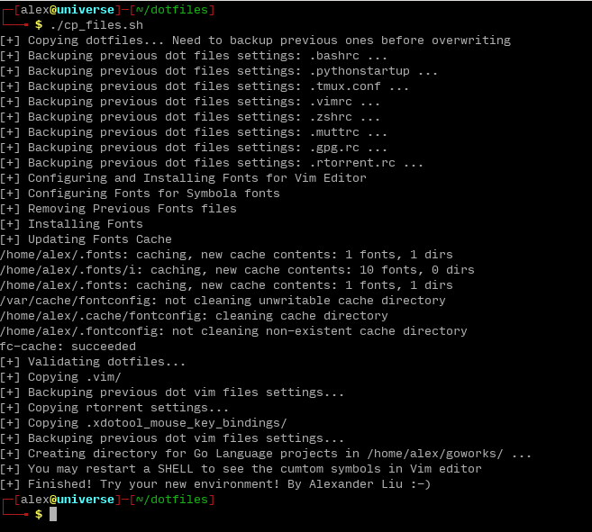
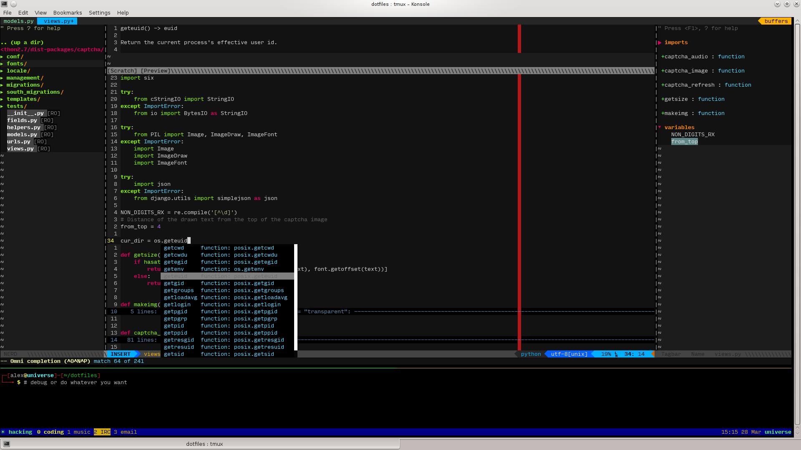

Dot files
===
    Dot files for Bash, Zsh, Vim, Elinks, Mutt, Gnupg, Python, Rtorrent.
    A Python IDE for Vim is built in.
                          --- Created by xros
VIM Plugins including
---
*   jedi
*   ctags
*   tagbar
*   csv.vim
*   NERDTree
*   ftplugin
*   supertab
*   emmet-vim
*   ctrlp.vim
*   ultisnips
*   numbers.vim
*   nerdcommenter
*   vim-airline
*   vim-airline-themes
*   vim-fugitive
*   vim-indent-guides
*   vim-multiple-cursors
*   vim-python-pep8-indent
*   Default Vim colorscheme is molokai
*   and so on , just check it out. For VIM 7.3+

##### An Easter egg
* Try <kbd>\\</kbd><kbd>r</kbd> to see what's gonna happen in your Vim :) Hit <kbd>Ctrl</kbd><kbd>c</kbd> to escape.

Usage
----
* Use the script ```cp_files.sh``` to **backup** previous files and **replace** them within files in this project. The ```cp_files.sh``` will copy those dotfiles to the system user's home folder.
* These settings are shipped with configuration files for some common tools, including `Elinks, Vim, Mutt, Python(2/3), Zsh, Rtorrent, Golang-go, Ardupilot and etc.`
* Usage:

    
    
* Default Vim colorscheme is molokai
* The bash scheme looks like this by default.

    


Explanation
----
* This is very neat for new PC initialization. Mostly for Debian/Ubuntu or its derived destros. This is friendly compaitble with Ubuntu12.04+/Linuxmint13+/Debian6+/Ubuntu14.04/Ubuntu16.04 and more their derived destros.

* Notice that: For some vim users to use tagbar/ctags, they would need to install the package "ctags". For example on debian/ubuntu ```sudo apt-get install ctags``` , or on centOS/Fedora/RHEL ```sudo yum install ctags```, or on archlinux ```pacman -S ctags```
* The ```init_*.sh``` and the ```cp_files.sh``` are very neat for new users both on ubuntu12.04 and ubuntu14.04.
```init_ubuntu_12.04.sh``` is compatible with Debian7/Ubuntu12.04 while ```init_ubuntu_14.04.sh``` is for Ubuntu14.04. The default Vim provided on Ubuntu 16.04 is not pre-compiled with `Python` support. To use these Vim settings, you should install Vim with Python support. See [here]() for info about compiling it, or [here]() to download a Vim deb package pre-compiled with `Python` support.

#### Python IDE
* There's a Python IDE inside. Type **:Ide** in the Vim prompt console.
* Press <kbd>F9</kbd> to enter Python IDE
* Using ```:b [your_file_name]``` to switch between different buffers windows in Vim
    

    Paste mode toggle: <kbd>F2</kbd>

    numbers.vim toggle: <kbd>F3</kbd>

    Re-fresh CtrlP fuzzy search cache switch: <kbd>F5</kbd>

    Snippets can be found at ```.vim/UltiSnips/```

    Ultisnips open key trigger: <kbd>\\</kbd><kbd>s</kbd>

    Ultisnips jump forward trigger: <kbd>\\</kbd><kbd>f</kbd>

    Ultisnips jump backward trigger: <kbd>\\</kbd><kbd>b</kbd>

    *Notice*: ```<leader>``` in ```.vimrc``` represents <kbd>\\</kbd> 


#### HTML IDE
* There's a HTML IDE inside. It was detrived from [emmet-vim](https://github.com/mattn/emmet-vim).

##### Quick Tutorial

Open or create a New HTML File:

    vim index.html

Type something ( Notice: "\_" is the cursor position):

    html:5_

Then type `<c-y>,` (<kbd>Ctrl</kbd><kbd>y</kbd><kbd>,</kbd>), and you should see:

```html
<!DOCTYPE HTML>
<html lang="en">
<head>
        <meta charset="UTF-8">
        <title></title>
</head>
<body>
        _
</body>
</html>
```

Type

```
test1
test2
test3
```

Then select these 3 lines using Vim visual line keys <kbd>Shift</kbd><kbd>v</kbd>. Then press keys <kbd>Ctrl</kbd><kbd>y</kbd><kbd>,</kbd>, you will see what it shows as the followings. Please try it.


* More info about this tool can be found at [emmet-vim](https://github.com/mattn/emmet-vim) and [more tutorials](https://raw.github.com/mattn/emmet-vim/master/TUTORIAL).

#### CSV editor
* For csv/dat file editing using csv.vim
    
    
    The demo of CSV file editing:
    
    

##### Notice:
> If your csv file is very big, please do not edit it using Vim. It would be slow. Libreoffice is your friend. But viewing csv files in this manner makes me feel great.


#### Have Fun ####
By [xros](https://github.com/xros)

