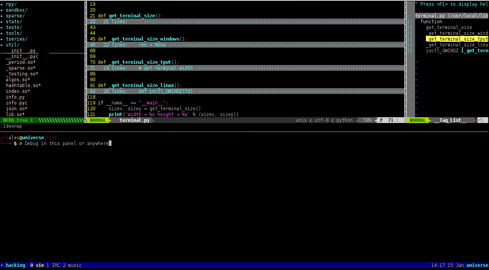

Dot files
===
    Dot files for Bash, Zsh, Vim, Elinks, Mutt, Python, Rtorrent.
    A Python IDE for Vim is built in.
                          --- Created by xros
VIM Plugins including
---
*   ctags
*   jedi
*   csv.vim
*   taglist
*   NERDTree
*   ftplugin
*   supertab
*   vim-powerline
*   vim-multiple-cursors
*   vim-python-pep8-indent
*   and so on , just check it out. For VIM 7.3+

Usage
----
* Use the script ```cp_files.sh``` to **backup** previous files and **replace** them within files in this project. The ```cp_files.sh``` will copy those dotfiles to the system user's home folder.
* These settings are shipped with configuration files for some common tools, including `Elinks, Vim, Mutt, Python(2/3), Zsh, Rtorrent, Golang-go, Ardupilot and etc.`
* The bash scheme looks like this by default.
    


Explanation
----
* This is very neat for new PC initialization. Mostly for Debian/Ubuntu or its derived destros. This is friendly compaitble with Ubuntu12.04+/Linuxmint13+/Debian6+ and more their derived destros.

* Notice that: For some vim users to use taglist/ctags, they would need to install the package "ctags". For example on debian/ubuntu ```sudo apt-get install ctags``` , or on centOS/Fedora/RHEL ```sudo yum install ctags```, or on archlinux ```pacman -S ctags```
* The ```init_*.sh``` and the ```cp_files.sh``` are very neat for new users both on ubuntu12.04 and ubuntu14.04.
```init_ubuntu_12.04.sh``` is compatible with Debian7/Ubuntu12.04 while ```init_ubuntu_14.04.sh``` is for Ubuntu14.04.

#### Python IDE
* There's a Python IDE inside. Type **:Ide** in the Vim prompt console.


#### CSV editor
* For csv/dat file editing using csv.vim
    
    
    The demo of CSV file editing:
    
    

##### Notice:
> If your csv file is very big, please do not edit it using Vim. It would be slow. Libreoffice is your friend. But viewing csv files in this manner makes me feel great.


#### Have Fun ####
By [xros](https://github.com/xros)

